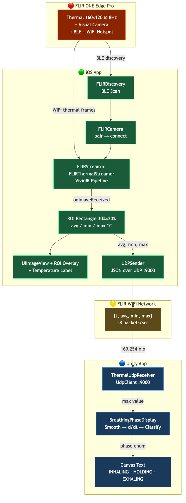

# Touchless Breathing Sensor System

Non-contact detection of breathing phases (**inhale / hold / exhale**) using a **FLIR ONE Edge Pro** thermal camera. The iOS app streams a region-of-interest temperature in real time over UDP; a Unity app classifies the phase from the signal's rate of change and displays it on a Canvas.

## How it works

Exhaled breath is ~32–34 °C; inhaled ambient air is ~20–22 °C. Point the thermal camera at the nostrils and the temperature inside a small region of interest (ROI) oscillates at breathing frequency (~0.2–0.5 Hz). Exhales push the signal up; inhales pull it down.

## Architecture



The Mermaid source is in [architecture.mmd](architecture.mmd). End-to-end data flow:

```
FLIR ONE Edge Pro  ─BLE discovery─→  iOS app (FLIROneCameraSwift)
                   ─WiFi thermal─→   │
                                     ├─ FLIRStream + VividIR pipeline
                                     ├─ ROI rectangle (30% × 20% of frame)
                                     ├─ avg / min / max in °C
                                     ├─ UIImageView + yellow dashed ROI overlay
                                     └─ UDPSender (JSON :9000)
                                                  │
                                     FLIR WiFi hotspot (169.254.x.x)
                                                  │
                                     Unity app (BreathingReceiver)
                                     ├─ ThermalUdpReceiver :9000
                                     ├─ BreathingPhaseDisplay (EMA → d/dt → classify)
                                     └─ Canvas Text: INHALING / HOLDING / EXHALING
```

## Hardware

- **FLIR ONE Edge Pro** thermal camera (160 × 120, 8–14 µm, ~8 Hz, BLE + WiFi).
- **iPhone** running iOS 14+ with Bluetooth enabled.
- **Computer** running Unity (macOS or Windows), with network access to the same WiFi as the iPhone.

## Repository layout

```
Touchless_Breathing_Sensor_System/
├── FLIROneCameraSwift.xcodeproj       Xcode project
├── FLIROneCameraSwift/                iOS source (Swift)
│   ├── ViewController.swift           Discovery, streaming, ROI, overlay, UDP send
│   ├── AppDelegate.swift
│   ├── Info.plist                     BLE + Bonjour entitlements
│   └── FLIROneCameraSwift.entitlements
├── UDPSender.swift                    NWConnection UDP client
├── Unity/
│   ├── ThermalUdpReceiver.cs          UdpClient listener + JSON parser
│   └── BreathingPhaseDisplay.cs       Phase classifier + Canvas UI
├── architecture.mmd                   Mermaid source
├── architecture.png                   Rendered diagram
├── .gitignore
└── README.md
```

## Part 1 — iOS setup

### 1. Download the FLIR Atlas SDK

The proprietary FLIR frameworks are **not checked in**. Get `atlas-objc-sdk-ios-xcode15-arm64-2.18.0` from the [FLIR developer portal](https://flir.custhelp.com/app/answers/detail/a_id/3220/).

### 2. Place the frameworks

The Xcode project references 9 frameworks at `../<Framework>.framework` (one directory above the project folder). Extract the SDK and arrange as:

```
<parent>/
├── FLIROneCameraSwift/                    ← this repo
│   ├── FLIROneCameraSwift.xcodeproj
│   └── ...
├── ThermalSDK.framework
├── liblive666.dylib.framework
├── libavutil.60.dylib.framework
├── libavcodec.62.dylib.framework
├── libavformat.62.dylib.framework
├── libavdevice.62.dylib.framework
├── libavfilter.11.dylib.framework
├── libswscale.9.dylib.framework
└── libswresample.6.dylib.framework
```

### 3. Configure signing

Open `FLIROneCameraSwift.xcodeproj`. Select the `FLIROneCameraSwift` target → **Signing & Capabilities** → set your Team + a unique Bundle Identifier (e.g. `com.<yourorg>.FLIROneCameraSwift`).

### 4. Set the Unity host IP

Edit [`FLIROneCameraSwift/ViewController.swift`](FLIROneCameraSwift/ViewController.swift) and update the UDP destination to the LAN IP of the machine running Unity:

```swift
let udpSender = UDPSender(host: "169.254.220.80", port: 9000)
//                               ^^^^^^^^^^^^^^
//                               Your Unity host's IP on the FLIR network
```

To find this IP on macOS after joining the FLIR hotspot: `ifconfig | grep "inet 169"`. On Windows: `ipconfig`.

### 5. Build & run on a physical iPhone

The Simulator cannot access BLE or the camera's WiFi — a real device is required.

### 6. Connect to the camera

1. Launch the app. Grant Bluetooth permission on the first prompt.
2. Power on the FLIR ONE Edge Pro.
3. Tap **Connect Device**. The SDK handles BLE pairing + WiFi handshake automatically (the same flow the official FLIR ONE app uses).
4. Once connected, point the camera at your nostrils ~15–20 cm away so they fall inside the yellow dashed ROI.
5. The on-screen label shows live `avg / min / max` in °C, and UDP packets start flowing immediately.

### Recommended VividIR settings for breathing detection

- **Upscale**: Trilateral (no temporal smoothing — preserves per-frame signal)
- **Latency**: lowest
- **Denoise**: OFF

These choices maximize temporal fidelity, which matters more than visual sharpness for accurate phase detection.

## Part 2 — Network setup

All three devices — iPhone, FLIR camera, and Unity host — must share one network.

### Option A: FLIR hotspot (link-local)

1. On the FLIR ONE Edge Pro, enable WiFi hotspot mode (default on most firmware).
2. On the Unity host, join the camera's WiFi (SSID like `FLIRONE_xxxxxx`). Ignore the "no internet" warning.
3. The iPhone auto-associates when the app connects.
4. All devices get self-assigned **169.254.x.x** addresses (link-local / RFC 3927 — no DHCP).

A Mac with a secondary WiFi interface (dock, USB adapter) can stay on its primary network for internet access while the secondary adapter handles the FLIR link.

### Option B: FLIR Station mode on existing WiFi

If your Edge Pro firmware supports Station mode, configure it through the FLIR ONE consumer app to join your regular WiFi network. All devices then share normal 192.168.x.x or 10.x.x.x addresses.

### Verifying UDP arrives at the Unity host

Before launching Unity, run this on the host to confirm packets arrive:

```bash
python3 -c "
import socket
s = socket.socket(socket.AF_INET, socket.SOCK_DGRAM)
s.bind(('0.0.0.0', 9000))
print('Listening on UDP :9000')
while True:
    data, addr = s.recvfrom(4096)
    print(f'{addr[0]}: {data.decode()}')"
```

Expected output (~8 Hz):

```
169.254.146.208: {"t":1776174345.296618,"avg":21.90,"min":21.65,"max":22.13}
```

## Part 3 — Unity setup

### 1. Create the Unity project

Open Unity Hub → New Project → 3D (Built-in Render Pipeline), Unity 2022 LTS or newer. Any project name works.

### 2. Add the scripts

Drag [`Unity/ThermalUdpReceiver.cs`](Unity/ThermalUdpReceiver.cs) and [`Unity/BreathingPhaseDisplay.cs`](Unity/BreathingPhaseDisplay.cs) into your `Assets` folder.

### 3. Set up the receiver GameObject

1. Hierarchy → right-click → **Create Empty**, name it `ThermalReceiver`.
2. With it selected, Inspector → **Add Component → Thermal Udp Receiver**. Port defaults to 9000.

### 4. Set up the Canvas UI

1. Hierarchy → right-click → **UI → Canvas** (also creates an EventSystem).
2. Right-click the new `Canvas` → **UI → Text — Legacy**.
3. Select the Text. In the Inspector:
   - Font Size: 80
   - Alignment: Center / Middle
   - Horizontal Overflow: Overflow
   - Anchor preset (RectTransform): center / middle, stretch
4. With the Text selected, **Add Component → Breathing Phase Display**.
5. In the new component:
   - Drag the `ThermalReceiver` GameObject into the **Receiver** slot.
   - Drag the Text component into the **Label** slot.

### 5. Press Play

- First ~2 s: `CALIBRATING` (gray) while the EMA seeds.
- After that: text cycles through `HOLDING` (white), `EXHALING` (orange), `INHALING` (blue).
- The `ThermalUdpReceiver` Inspector fields `avg / min / max / timestamp / connected` update live.
- The Console logs ~twice per second.

Allow macOS / Windows Firewall prompts for incoming UDP.

## Tuning the phase detector

All exposed in the `Breathing Phase Display` Inspector:

| Parameter | Default | Effect |
|---|---|---|
| Smoothing Tau | 0.3 s | Low-pass on the raw max temperature. Higher = smoother, slower response. |
| Derivative Tau | 0.4 s | Low-pass on the rate of change. Higher = fewer false phase flips. |
| Exhale Rate | +0.25 °C/s | Rising-rate threshold to enter EXHALING. Raise if head motion triggers exhale; lower if real exhales aren't caught. |
| Inhale Rate | −0.25 °C/s | Falling-rate threshold to enter INHALING. Mirror of exhale rate. |
| Warmup Seconds | 2.0 s | Calibration period before the first classification. |

**Tuning procedure:** watch the live `ratePerSecond` field in the Inspector as you breathe. Note the peak positive value during a real exhale — set `Exhale Rate` to roughly half of that. Do the same for inhales with the negative threshold.

## Algorithm summary

1. **ROI measurement (iOS):** `FLIRMeasurementRectangle` at center 30 % × 20 % of the 160×120 thermal frame. SDK returns average / min / max per frame.
2. **Transport:** JSON payload `{"t": <unix_seconds>, "avg": <°C>, "min": <°C>, "max": <°C>}` over UDP to port 9000 (~80 bytes per packet, ~8 Hz).
3. **Smoothing (Unity):** EMA on the `max` channel with τ = 0.3 s.
4. **Differentiation:** instantaneous rate `(current − previous) / Δt`, smoothed again with τ = 0.4 s.
5. **Classification:** threshold the rate (± 0.25 °C/s) with hysteresis — once in a phase, require the rate to fall past 50 % of the entry threshold before transitioning to HOLDING.

## Troubleshooting

| Symptom | Likely cause | Fix |
|---|---|---|
| Xcode console stuck on `waiting for BLE` | BLE permission denied, or another app holding the camera's BLE | iOS Settings → FLIROneCameraSwift → Bluetooth ON. Force-quit FLIR ONE consumer app. Power-cycle the camera. |
| `connect error ... timeout` | iPhone can't reach camera over WiFi | Confirm iPhone is on the FLIR hotspot and camera WiFi is enabled (BLE `wifiMode = 1`). |
| No UDP packets in Unity | Unity host not on the FLIR network, or firewall blocking | Verify with the Python listener snippet above. Allow UDP 9000 through the firewall. |
| Packets arrive, phase stuck at `CALIBRATING` | `receiver.connected` never set true | Ensure the `ThermalReceiver` GameObject is active and the script's `port` matches the iOS sender. |
| Phase flickers wildly | Thresholds too low | Raise `Exhale Rate` / `Inhale Rate` magnitudes, or increase `Derivative Tau`. |
| No detection even with visible breath | ROI not on nostrils, or camera too far | Move closer (~15–20 cm). Aim so nostrils fall clearly inside the yellow dashed ROI. |

## License

The FLIR Atlas SDK binaries are proprietary to Teledyne FLIR — refer to FLIR's SDK license. The project source (Swift + C#) in this repository is for educational / research use.
